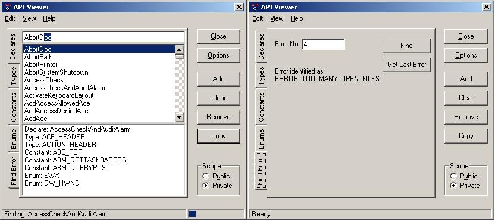



## A\+\+ API Viewer \(with find error from error number\!\)

### Description

An excellent alternative to the standard API Text Viewer with extra functions! This has the standard Declares, Types and Constants but also Enumerations where certain groups of constants have been neatly formatted into an easy to use Enum.

Also find error code! This function will find the error from the error code or from the GetLastError API.

This also includes AutoComplete, variable scope ie: Private or Public.

Also shows how to put a progressbar in a status bar.

An excellent source of database access code for getting started for a database frontend.

API Viewer will also copy your entries to the clipboard and format them into an easy to read format.

Please vote!
 
### More Info
 
A set of APIs!

             |
---                |---
**Submitted On**   |2002-09-29 21:44:06
**By**             |[Edward Catchpole](https://github.com/Planet-Source-Code/PSCIndex/blob/master/ByAuthor/edward-catchpole.md)
**Level**          |Intermediate
**User Rating**    |5.0 (45 globes from 9 users)
**Compatibility**  |VB 6\.0
**Category**       |[Complete Applications](https://github.com/Planet-Source-Code/PSCIndex/blob/master/ByCategory/complete-applications__1-27.md)
**World**          |[Visual Basic](https://github.com/Planet-Source-Code/PSCIndex/blob/master/ByWorld/visual-basic.md)
**Archive File**   |[A\+\+\_API\_Vi1392161012002\.zip](https://github.com/Planet-Source-Code/edward-catchpole-a-api-viewer-with-find-error-from-error-number__1-39424/archive/master.zip)

